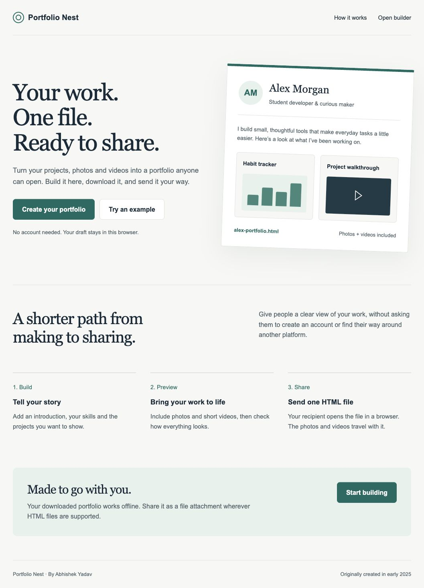

# Portfolio Nest

**Your work. One file. Ready to share.**

**[Try the live demo](https://abijeason.github.io/portfolio-nest/)**

Portfolio Nest is a browser-based portfolio builder that packages an introduction, projects, photos and videos into one self-contained HTML file. The recipient opens the file in a browser without creating an account or signing in to a platform.

Originally created by **Abhishek Yadav in early 2025** as a university project. This edition was enhanced in **October 2026**, with a refreshed interface, automatic draft saving and a standalone export. The repository records the current publication date; the original creation date is documented here rather than represented as backdated commits.



## What it does

- Collects an introduction, headline, skills and optional contact email.
- Supports multiple projects with descriptions and optional website links.
- Includes an optional profile photo and project photos or videos.
- Saves and restores the draft in the same browser using IndexedDB.
- Previews the portfolio and allows editing before download.
- Exports one HTML file with inline styling and embedded media, without external scripts, fonts or stylesheets.
- Provides responsive layouts, keyboard focus indicators and helpful upload messages.

## Run locally

There are no application dependencies or build steps. Start a static server from the project folder:

```sh
python3 -m http.server 8000
```

Open **http://localhost:8000** in a modern browser. Use a local server for the builder so browser storage works consistently. The exported portfolio itself is designed to open directly as an HTML file.

## Build and share a portfolio

1. Choose **Create your portfolio**, or **Try an example** to load fictional sample details.
2. Enter your name and introduction. Add skills, projects and contact details as needed.
3. Add photos and short videos.
4. Select **Preview portfolio**, check the result, and return to **Edit portfolio** if needed.
5. Select **Download HTML**. Open the saved file in your browser and check it before sharing.
6. Send the HTML file as an attachment through a service that supports HTML files. Recipients should download it and open it in a browser.

## Media and storage

- Supported photos: JPG, PNG, WebP, GIF and AVIF.
- Supported videos: MP4, WebM and Ogg. Codec support depends on the recipient's browser; a short MP4 video is usually a practical choice.
- The combined upload limit is **12 MB** before encoding. Embedding media increases its size by roughly one third, so the exported HTML is larger than the original uploads.
- Drafts stay in the browser on the current device and website address. They do not sync between devices; clearing site data removes them.
- The app has no backend upload service, account system or analytics. Media selected in the builder is read locally and stored in the browser.
- Anyone who receives the exported file can access the included contact details and media. Some email providers block HTML attachments; choose a supported sharing method.
- Optional external project links and email links need an internet connection or email application when used. The portfolio text, styles and embedded media do not.

## Technology

**HTML, CSS and vanilla JavaScript**, using browser APIs including IndexedDB, FileReader, Blob and object URLs. No frontend framework or third-party runtime dependencies.

| File | Purpose |
| --- | --- |
| `index.html` | Landing page and introduction |
| `builder.html`, `builder.js` | Form, project editing and media selection |
| `storage.js` | Local draft persistence |
| `preview.html`, `preview.js` | Portfolio preview and download |
| `core.js` | Shared portfolio rendering, validation and standalone export |
| `styles.css` | Responsive builder and landing-page styles |
| `core.test.js` | Export and validation regression tests |

## Tests

Requires Node.js 18 or newer, without installing packages:

```sh
node --test core.test.js
```

The tests cover self-contained exports, image and video embedding, optional content, input escaping, safe project links, supported media types, the combined size limit, save completion tracking and protection of incomplete drafts when loading examples.

Browser checks for this edition covered creating a draft, restoring it for editing, uploading a real PNG and MP4, media decoding in the preview and standalone export, and layout at a 390-pixel mobile width. Direct local-file opening and automatic download capture could not be verified in the restricted test browser; use the file-opening check in the sharing instructions above.

## Project history

See [CHANGELOG.md](CHANGELOG.md) for the early-2025 version and October-2026 improvements. Original coursework files were preserved separately during this refresh.

The example names and projects are fictional. The repository screenshots illustrate the interface, rather than additional projects claimed by the author.
